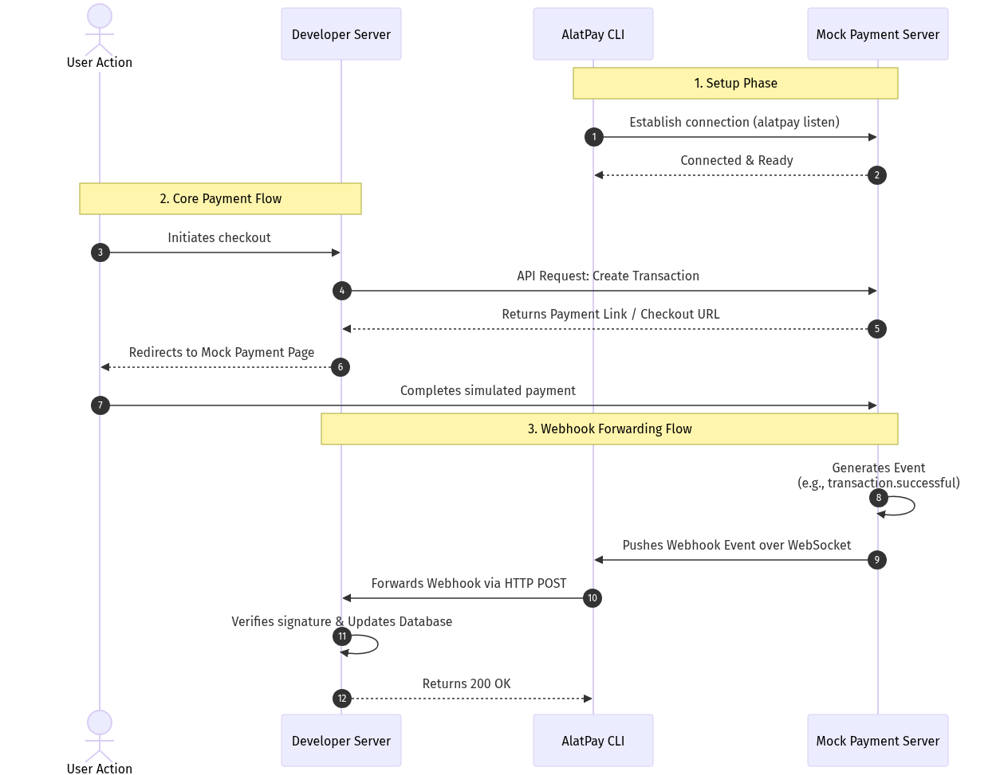

# AlatPay CLI & Mock Server Toolkit

A powerful, developer-centric toolkit for interacting with AlatPay servers, managing webhooks, simulating server environments, and providing a clean local developer experience.



This repository contains two primary components:
1. `alatpay`: The fully-featured locally-installable CLI tool.
2. `alatpay-mock-server`: A mock WebSocket relay server for testing and receiving webhook events locally.

---

## ⚡️ Quick Start

### 1. The Mock Server

The mock server acts as your local "AlatPay Platform", receiving webhooks via POST and broadcasting them to connected WebSocket clients (like the CLI).

```bash
# Navigate to the mock server directory
cd alatpay-mock-server

# Run the mock server (starts on port 8081)
go run main.go
```

The mock server endpoints:
- **Webhook Receiver:** `POST http://localhost:8081/webhook`
- **WebSocket Relay:** `ws://localhost:8081/ws`

### 2. The CLI (`alatpay`)

The CLI is your primary interface for creating transactions, authenticating, triggering mock events, and listening to webhook streams securely.

```bash
# Navigate to the CLI directory
cd alatpay

# Build the CLI application
go build -o alatpay .

# Run the help command to see all available tools
./alatpay --help
```

---

## 🛠️ CLI Features & Commands

### 1. Initial configuration (`auth`)
Securely configures the CLI with your AlatPay credentials.
```bash
./alatpay auth
```

### 2. Live Webhook Listener (`listen`)
Connects to the mock server via WebSocket, intercepts events, verifies HMAC signatures, and displays real-time payloads.
```bash
# Listen to the webhook stream in the terminal
./alatpay listen

# Listen AND start a beautiful Web UI dashboard on port 8181
./alatpay listen --ui --ui-port 8181

# Forward webhooks to your local application
./alatpay listen --forward-to http://localhost:3000/api/webhook
```

### 3. Mock Event Trigger (`trigger`)
Need to test your implementation? Use the trigger command to simulate specific AlatPay events (like payments). It automatically generates the correct HMAC signatures matching your configuration!
```bash
# Trigger a default payment.successful event
./alatpay trigger

# Trigger a specific event type
./alatpay trigger payment.failed
```

### 4. Transactions API (`transaction`)
Interact directly with the AlatPay transactions API.
```bash
# Create a new payment transaction
./alatpay transaction create 5000 NGN jdoe@example.com

# Check the status of an existing transaction
./alatpay transaction status tx_1234abcd5678
```

### 5. Log streams (`logs tail`)
Continuously tail real-time request logs directly in your development terminal with connection resiliency.
```bash
./alatpay logs tail
```

---

## 🏗️ Building and Installing

If you want to install the `alatpay` tool globally on your system to use without the `./` prefix:

```bash
cd alatpay
go install .
```
*(Ensure your `$(go env GOPATH)/bin` directory is in your system's `$PATH`)*.

---

## 🛡️ Security Note
The CLI securely stores your API keys and Webhook secret locally in your home directory (`~/.alatpay/config.json`) with strict file permissions to ensure your secrets remain safe. 
