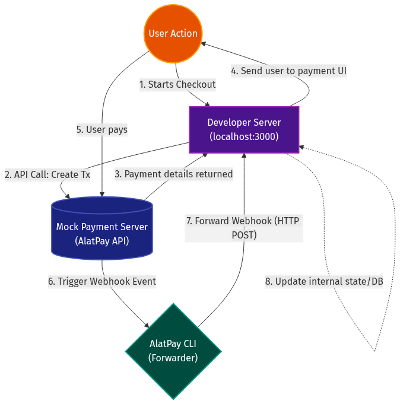

# AlatPay CLI Flow Diagrams

The following diagrams illustrate the AlatPay CLI checkout and webhook routing flow.

## 1. High-Level Flowchart
This flowchart shows the overall architecture and interactions.

---

## 2. Detailed Sequence Diagram
This sequence diagram breaks down the synchronous and asynchronous steps in the payment checkout and webhook forwarding lifecycle.

